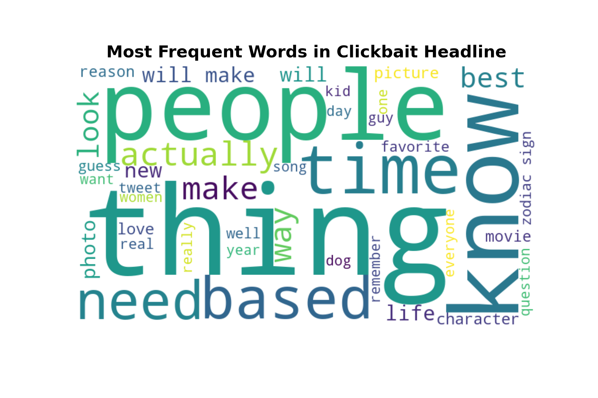
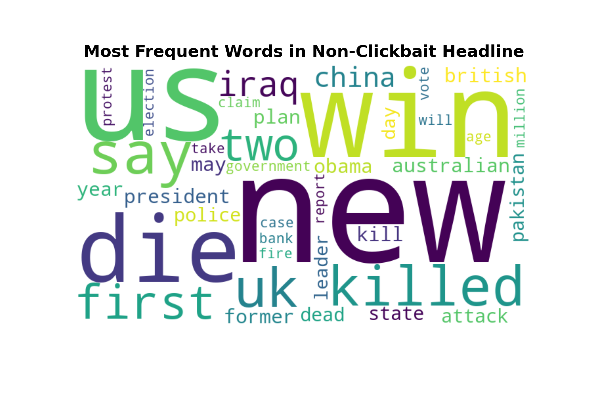
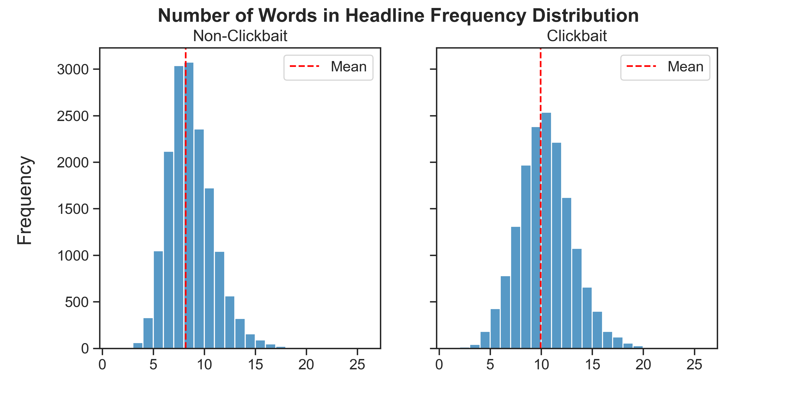
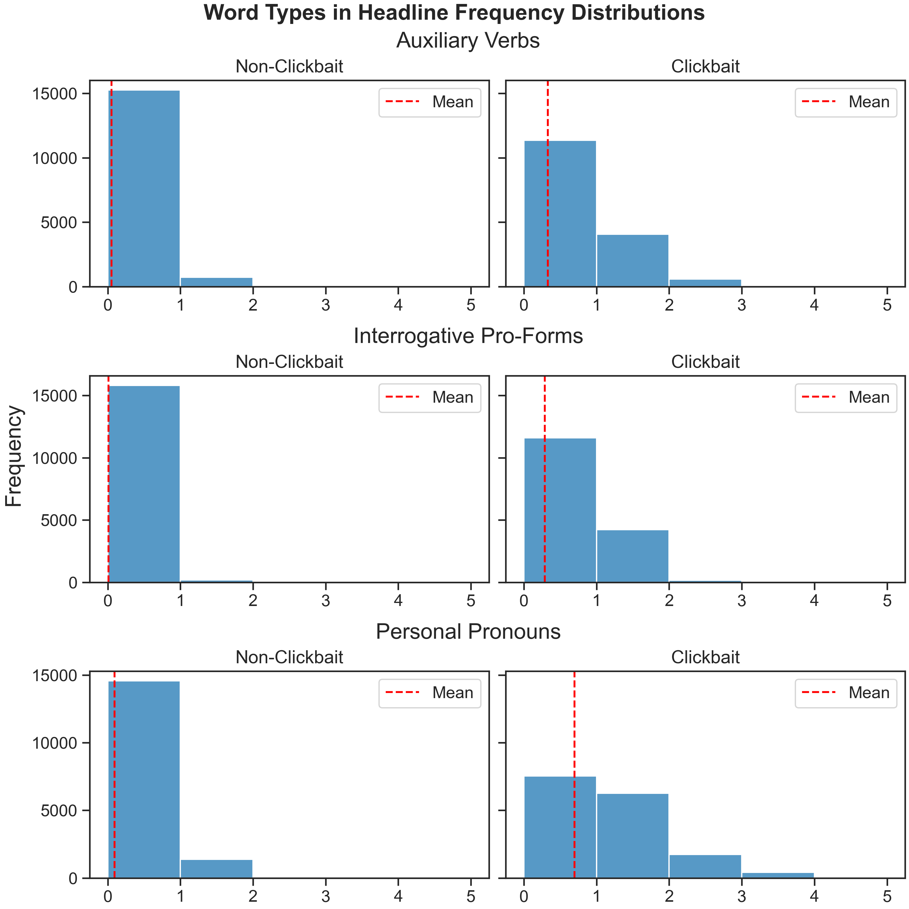

# Using Natural Language Processing to Detecting Clickbait in Headlines—A Case Study

Description...

## Data Exploration

Word clouds of the most occurring words in clickbait

    

    

    

    
</p

Check out a detailed implementation of the exploratory data analysis and visualizations in `data_exploration.ipynb` or `data_exploration.html`.
## References

We used data from the following sources:

Anand, A. (April 18, 2020). _Clickbait Dataset_ (Version 1) [Dataset]. Retrieved November 23, 2021 from [https://www.kaggle.com/amananandrai/clickbait-dataset](https://www.kaggle.com/amananandrai/clickbait-dataset).

Nielsen, F. Å. (2015). _AFINN-en-165_ [Dataset]. Retrieved December 1, 2021 from [https://github.com/fnielsen/afinn/tree/master/afinn/data](https://github.com/fnielsen/afinn/tree/master/afinn/data)

Wikipedia contributors. (2019, April 8). _Category:English interrogative pro-forms - Wiktionary_. Wikipedia. Retrieved December 3, 2021, from [https://en.wiktionary.org/wiki/Category:English_interrogative_pro-forms](https://en.wiktionary.org/wiki/Category:English_interrogative_pro-forms)

Wikipedia contributors. (2021a, October 22). _Auxiliary verb_. Wikipedia. Retrieved December 3, 2021, from [https://en.wikipedia.org/wiki/Auxiliary_verb](https://en.wikipedia.org/wiki/Auxiliary_verb)

Wikipedia contributors. (2021b, November 15). _English personal pronouns_. Wikipedia. Retrieved December 3, 2021, from [https://en.wikipedia.org/wiki/English_personal_pronouns](https://en.wikipedia.org/wiki/English_personal_pronouns)
