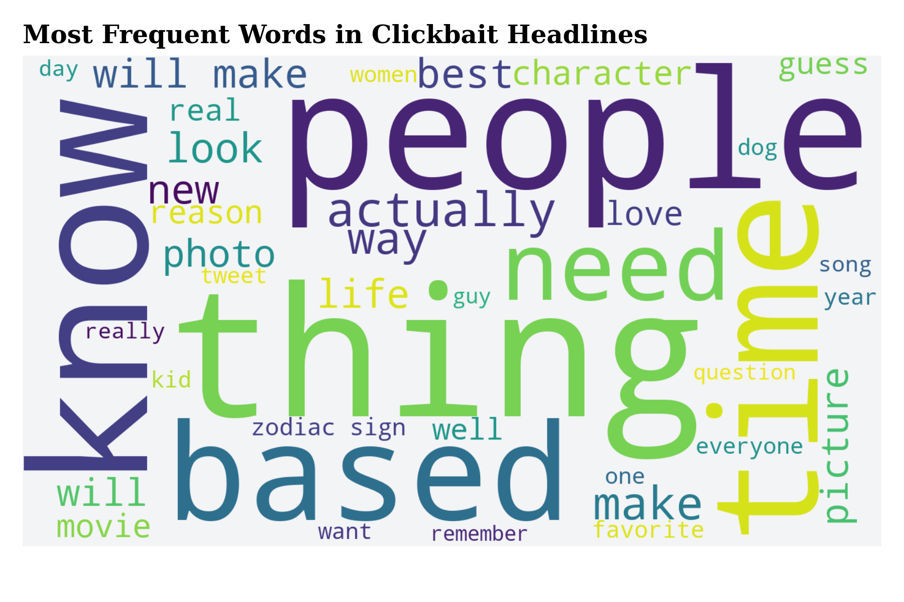

# Using Natural Language Processing to Detecting Clickbait in Headlines—A Case Study

Description...

## Data Exploration

Word clouds of the most occurring words in clickbait

    

    

    

    
</p

Check out a detailed implementation of the exploratory data analysis and visualizations in `data_exploration.ipynb` or `data_exploration.html`.

## Headline Classification

To classify headlines as clickbait and non-clickbait, we developed two supervised machine learning models:

1. We simple used the most frequent words in headlines to train our model thereby trying out different number of top words.
2. Using the insights gained from our data exploration, we developed more granular features such as different word types, word sentiment and word count in headlines.

### Model Accuracy

When testing the *first model* the accuracy was about

| n    | model         | accuracy | time (s) |
|------|---------------|----------|----------|
| 10   | Naive Bayes   | 81%      | 0.3      |
| 10   | Decision Tree | 81%      | 5.1      |
| 100  | Naive Bayes   | 90%      | 2.5      |
| 100  | Decision Tree | 90%      | 220      |
| 1000 | Naive Bayes   | 96%      | 25       |
| 1000 | Decision Tree | 93%      | 4879     |

where $n$ is the number of top most frequent words (e.g. top 10 most frequent words).

And when testing the *second model* the accuracy was about

| model         | accuracy | time (s) |
|---------------|----------|----------|
| Naive Bayes   | 79%      | 0.16     |
| Decision Tree | 79%      | 1.16     |

## References

We used data from the following sources:

Anand, A. (April 18, 2020). _Clickbait Dataset_ (Version 1) [Dataset]. Retrieved November 23, 2021 from [https://www.kaggle.com/amananandrai/clickbait-dataset](https://www.kaggle.com/amananandrai/clickbait-dataset).

Nielsen, F. Å. (2015). _AFINN-en-165_ [Dataset]. Retrieved December 1, 2021 from [https://github.com/fnielsen/afinn/tree/master/afinn/data](https://github.com/fnielsen/afinn/tree/master/afinn/data)

Wikipedia contributors. (2019, April 8). _Category:English interrogative pro-forms - Wiktionary_. Wikipedia. Retrieved December 3, 2021, from [https://en.wiktionary.org/wiki/Category:English_interrogative_pro-forms](https://en.wiktionary.org/wiki/Category:English_interrogative_pro-forms)

Wikipedia contributors. (2021a, October 22). _Auxiliary verb_. Wikipedia. Retrieved December 3, 2021, from [https://en.wikipedia.org/wiki/Auxiliary_verb](https://en.wikipedia.org/wiki/Auxiliary_verb)

Wikipedia contributors. (2021b, November 15). _English personal pronouns_. Wikipedia. Retrieved December 3, 2021, from [https://en.wikipedia.org/wiki/English_personal_pronouns](https://en.wikipedia.org/wiki/English_personal_pronouns)
